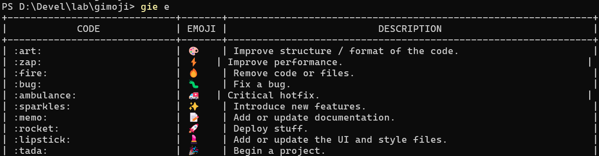

# gimoji

## 文档 [中文](README.md)|[EN](README.en.md)
## 安装 & 使用
```shell
go install github.com/huxulm/gie/cmd
```
## 使用
所有参数、子命令都直接传递到 `git` 中，除了 `git commit` 子命令会额外处理。
```
# use gie instead of git
gie commit -m ":art: welcome use gie!"
```
## Emoji 代码表
|代码| 表情符号| 说明|
|:---:|:---:|:---:|
|:art:|🎨|改进代码的结构/格式|
|:zap:|⚡️|提高性能|
|:fire:|🔥|删除代码或文件|
|:bug:|🐛|修复一个错误|
|:ambulance:|🚑️|关键修补程序|
|:parkles:|✨|引入新功能|
|:memo:|📝|添加或更新文档|
|:rocket:|🚀|部署东西|
|:lipstick:|💄|添加或更新 UI 和样式文件|
|:tada:|🎉|开始一个项目|
|:white_check_mark:|✅|添加、更新或通过测试|
|:lock:|🔒️|修复安全或隐私问题|
|:close_lock_with_key:|🔐|添加或更新秘密|
|:bookmark:|🔖|发布/版本标签|
|:rotating_light:|🚨|修复编译器/linter 警告|
|:construction：|🚧| 正在进行中|
|:reen_heart:|💚|修复 CI 构建|
|:arrow_down:|⬇️|降级依赖项|
|:arrow_up:|⬆️|升级依赖项|
|:pushpin:|📌|将依赖项固定到特定版本|
|:construction_worker:|👷|添加或更新 CI 构建系统|
|:chart_with_upwards_trend:|📈|添加或更新分析或跟踪代码|
|:recycle:|♻️|重构代码|
|:heavy_plus_sign:|➕|添加依赖项|
|:heavy_minus_sign:|➖|删除依赖项|
|:wrench:|🔧|添加或更新配置文件|
|:hammer:|🔨|添加或更新开发脚本|
|:globe_with_meridians:|🌐|国际化和本地化|
|:pencil2:|✏️|修正拼写错误|
|:poop:|💩|编写需要改进的糟糕代码|
|:rewind:|⏪️|恢复更改|
|:twisted_rightwards_arrows:|🔀|合并分支|
|:package:|📦️|添加或更新编译的文件或包|
|:alien:|👽️|由于外部 API 更改而更新代码|
|:truck:|🚚|移动或重命名资源（例如：文件、路径、路线）|
|:page_face_up:|📄|添加或更新许可证|
|:boom:|💥|引入重大更改|
|:bento:|🍱|添加或更新资产|
|:wheelchair:|♿️|改善无障碍环境|
|:ulb:|💡|添加或更新源代码中的注释|
|:beers:|🍻|喝醉了写代码|
|:speech_balloon:|💬|添加或更新文本和文字|
|:card_file_box:|🗃️|执行数据库相关的更改|
|:loud_sound:|🔊|添加或更新日志|
|:mute:|🔇|删除日志|
|:busts_in_silhouette:|👥|添加或更新贡献者|
|:children_crossing:|🚸|改善用户体验/可用性|
|:building_construction:|🏗️|进行架构更改|
|:iphone:|📱|致力于响应式设计|
|:clown_face:|🤡|模仿事物|
|:egg:|🥚|添加或更新复活节彩蛋|
|:see_no_evil:|🙈|添加或更新 .gitignore 文件|
|:camera_flash:|📸|添加或更新快照|
|:alembic:|⚗️|进行实验|
|:mag:|🔍️|改善搜索引擎优化|
|:label:|🏷️|添加或更新类型|
|:seedling:|🌱|添加或更新种子文件|
|:triangle_flag_on_post:|🚩|添加、更新或删除功能标志|
|:goal_net:|🥅|捕获错误|
|:dizzy:|💫|添加或更新动画和过渡|
|:wastebasket:|🗑️|弃用需要清理的代码|
|:passport_control:|🛂|处理与授权、角色和权限相关的代码|
|:adhesive_bandage:|🩹|对非关键问题的简单修复|
|:monocle_face:|🧐|数据探索/检查|
|:coffin:|⚰️|删除死代码|
|:test_tube:|🧪|添加失败的测试|
|:necktie:|👔|添加或更新业务逻辑|
|:stethoscope:|🩺|添加或更新健康检查|
|:bricks:|🧱|基础设施相关的变化|
|:technologist:|🧑‍💻|改善开发者体验|
|:money_with_wings:|💸|添加赞助或金钱相关的基础设施|
|:thread:|🧵|添加或更新与多线程或并发相关的代码|
|:safety_vest:|🦺|添加或更新与验证相关的代码|